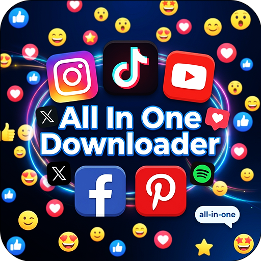

# 📤 All In One Downloader Bot | Download All Social Media 🤖


<div align="center">


</div>


<div align="center">
  <a href="https://t.me/AIODownx_bot"></a>
  <a href="https://github.com/shamikalk"></a>
  
  
</div>

## 💫 All In One Downloader Bot
Hello Their, WelCome to the **All In One Downloader Bot**  ([@AIODownx_bot](https://t.me/AIODownx_bot)). Your ultimate solution for saving and sharing videos from TikTok, Facebook, Pinterest, Instagram, Reddit & more — without any restrictions! Designed to provide a seamless experience, our bot lets you enjoy videos from all major social media platforms

### ✨ Features
| Feature | Description |
|---------|-------------|
|**🎵 TikTok** | Video (No WM / WM / HD) + Audio + Slides |
|**📘 Facebook** | SD / HD Video + Audio
|**📌 Pinterest** | Multiple resolutions (360p → 1080p) + Audio
|**📸 Instagram** | Reels, Posts, Stories (SD/HD)
|**🤖 Reddit** | Video + Audio tracks
|**▶️ YouTube** | Video(360p) + Audio(128kbps)
|**🐦 Twitter/X** | Coming soon 🔜

### 🎯 Additional Features
* **🔄 `/round`** — Convert any video to a Round video
* **🔄 `/voice`** — Convert any video or audio to a voice note
* **📤 Inline Mode** — Share videos directly in any chat
* **🔐 Channel Membership** — Required to prevent abuse
* **👥 Group Support** — Use the bot in groups! Just mention the bot or reply to a message

### 🔥 Power User Features
 - **Inline Mode:** Type @AIODownx_bot in any chat followed by a Social Media link
 - **Share Directly:** Forward downloaded videos to other chats with a single tap

## 🎮 How to Use
```
START → SEND ANY SOCIAL LINK → CHOOSE FORMAT → DOWNLOAD → SHARE
```
1. Start the bot: Send `/start`
2. Send any Social Media video URL to the bot
3. Choose your preferred download format (video, round video, audio)
4. Receive your content immediately
5. Use the downloaded content anywhere!


## 🎬 Round Video Conversion
Use `/round` as a reply to any video message:
```
START → SEND ANY SOCIAL LINK → CHOOSE FORMAT → DOWNLOAD → REPLY TO THE VIDEO "/round" → SHARE
```
## 🎵 Voice Note Conversion
Use `/round` as a reply to any video or audio message:
```
START → SEND ANY SOCIAL LINK → CHOOSE FORMAT → DOWNLOAD → REPLY TO THE VIDEO OR AUDIO "/voice" → SHARE
```


## 🔒 Privacy & Security

* ✅ No logs of your downloaded content
* ✅ No personal data stored (except user ID for anti-spam)
* ✅ Direct downloads — no third-party servers
* ✅ Channel verification prevents bot abuse

## 📜 Terms of Service

This bot is for personal use only. Respect the Terms of Service & Copyright Laws of all supported platforms (TikTok, Facebook, Pinterest, Instagram & ...etc). Users are responsible for their own usage.

## 📞 Contact & Support

For issues, suggestions, or feature requests:

* 🚀 **Developer: [@shamika](https://t.me/shamika_xd)**
* 📢 **Join our Support Channel: [JOIN](https://t.me/shamika_official_channel)**

---

<p align="center"> <b>Made with ❤️ By MR.Shamika</b><br> <i>No websites. No ads. No watermark. Just Telegram.</i> </p>
